# Blob → S3-Compatible Storage Migration (Vercel Blob → Garage) — Complete Guide

> **Audience:** junior dev executing this migration. Read top-to-bottom before touching code.
> **Status:** all design decisions locked —
> **Garage (self-hosted, S3-compatible)** on the office Ubuntu box via **Coolify**,
> **private bucket, served through a permanent app broker (no expiring links anywhere)**,
> **Postgres on the same box**, **30–45 min freeze-window cutover** (data < 10 GB),
> staging over **Tailscale**.
> **File refs** below are relative to repo root `E:\urvilbhai\modusys`.

---

## 0. TL;DR

| Question | Answer |
|---|---|
| What are we moving off? | Vercel Blob (`@vercel/blob@^2.8.0`, `package.json:31`), auth via `BLOB_READ_WRITE_TOKEN` |
| What are we moving to? | **Garage** (`dxflrs/garage:v2.x`), S3-compatible, private bucket `modusys`, talked to with the standard **AWS SDK v3 for JS** (`@aws-sdk/client-s3` + `@aws-sdk/s3-request-presigner`) |
| Why Garage, not AWS S3 cloud / MinIO? | Team call. Garage is lighter than MinIO on one small box, Rust single binary, tolerates office-network flakiness, first-class Coolify Service template. AWS S3 cloud stays a future option with zero code change (only `S3_ENDPOINT` env differs). See §3 |
| How do browsers get file bytes? | **Permanent broker addresses** served by our app (`/api/files/msg_<id>`, `/api/files/media_<id>`, `/api/files/att_<id>`). No temporary/expiring links anywhere in the view path. See §5 |
| What moves to the bucket? | Only 3 groups (§4): (1) attendance selfies, (2) customer gallery media, (3) chat attachments. Everything else stays out (§4.2) |
| Downtime? | **30–45 min freeze window** (§9). Writes frozen, copy-once is exact, no dual-read machinery |
| Public exposure? | Office server is private (tailnet-only) today. Migration prep runs over Tailscale; cutover waits on public reachability (§14). Vercel stays live as rollback standby meanwhile |
| Deleted chats/files | Count-before-destroy rule (§8.4) — forwarded copies can never be orphaned by design |
| Staging? | Tailscale-only staging on the office server: snapshot DB + `modusys-staging` bucket, no public DNS needed (§12) |
| DB move? | Separate cutover: Neon → local Postgres (`PrismaNeon` → `pg` adapter). File migration does **not** depend on it, but both land on the same Ubuntu box |

---

## 1. What we will use / what we will NOT use

### 1.1 We WILL use

1. **Garage** — S3-compatible object store (Deuxfleurs, Rust, AGPL). Single-node to start
   (`replication_factor = 1`), `db_engine = sqlite` (v2 default, simplest for 1 node),
   `s3_region = "garage"`. Ports: S3 API `:3900`, RPC `:3901`, web `:3902` (unused),
   admin `:3903` (localhost only). Why it fits: implements exactly the S3 subset modusys needs —
   `PutObject`, `GetObject` (+ `Range`), `HeadObject`, `DeleteObject`, `DeleteObjects`,
   `ListObjectsV2`, all 7 multipart endpoints, **presigned PUT (SigV4)** for direct browser
   uploads, `Put/Get/DeleteBucketCors` — confirmed on the official
   [S3 compatibility matrix](https://garagehq.deuxfleurs.fr/documentation/reference-manual/s3-compatibility/).
2. **AWS SDK v3 for JavaScript** in Next.js — `S3Client` with
   `{ endpoint: S3_ENDPOINT, region: "garage", forcePathStyle: true, credentials }`,
   `getSignedUrl(PutObjectCommand)` for upload mints (single-use, 120 s), direct
   `GetObject/PutObject/DeleteObject/HeadObject` for broker + server paths. Garage's own
   [JS guide](https://garagehq.deuxfleurs.fr/documentation/build/javascript/) defers to exactly
   these SDKs. One shared module owns all SDK calls: new `lib/server/s3.ts` (to be created, §8.1).
3. **App broker route (new)** — `GET /api/files/[ref]` where `ref` is `msg_<messageId>`,
   `media_<mediaId>`, or `att_<recordId>` (+ `?side=` for attendance, `?download=1` to force
   save-with-filename). Checks login + ownership, streams bytes from Garage. Permanent address,
   zero expiry logic. Full spec in §8.2/§8.5.
4. **Coolify** — Garage as a Coolify **Service** (template `Garage` exists per
   [Coolify docs](https://coolify.io/docs/services/garage)), Postgres as a Coolify database,
   Next.js as the app. Persistent storage = Compose mounts (source of truth), verified under
   Persistent Storages ([docs](https://coolify.io/docs/services/configuration/persistent-storage)).
5. **Existing Nginx** (already between clients and server) — TLS termination + routing:
   `app → Next.js`, `s3.<domain> → Garage :3900` for browser-direct PUT uploads (official
   [reverse-proxy cookbook](https://garagehq.deuxfleurs.fr/documentation/cookbook/reverse-proxy/)).
   Reads never touch Garage directly — they go through the broker.

### 1.2 We will NOT use / NOT need

| Thing | Why not |
|---|---|
| AWS S3 cloud (real `*.amazonaws.com`) | Not needed for v1; office box holds everything. Code stays endpoint-agnostic so AWS remains a 1-env-var switch later (`S3_ENDPOINT=""`) |
| MinIO | Team chose Garage. Do not install MinIO alongside — one S3 impl per box |
| Vercel Blob SDK (`@vercel/blob`, `handleUpload`, `upload()`, `put()`, `del()`) | Removed after cutover. Full touch list in §8 |
| Presigned GET / expiring view links, link-refresh tables, RAM blob caches | Rejected by decision: the broker serves permanent addresses. No expiry machinery exists, so no expiry bugs can exist |
| Bucket ACLs / Policies / versioning / SSE-KMS / tagging / object-lock | Garage doesn't implement them (see compat matrix) and **modusys uses none**. Access = Garage per-key-per-bucket allow (`garage bucket allow --read --write modusys --key modusys-app`) + our Next.js auth. Encryption = disk-level (LUKS) on the Ubuntu box |
| Garage `:3902` website hosting | We serve via the broker, not static-site hosting. Leave it off |
| Public bucket / permanent public URLs | Rejected (private bucket). The broker is the only reader, over loopback, with app credentials |
| Storing quote PDFs, CSV exports, logos in S3 | Out of scope — they are client-generated today (§4.2). Don't "improve" scope mid-migration |

---

## 2. Architecture

### 2.1 System diagram

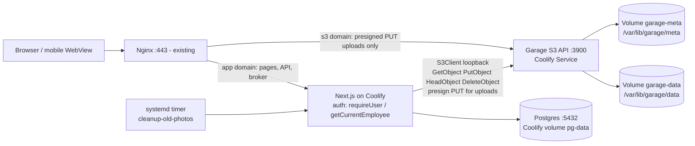

- **Nginx is a dumb pipe.** TLS + host routing only. Reads never reach Garage directly.
- **Next.js is the authorization gate.** Broker + presign endpoints reuse `requireUser()` /
  `getCurrentEmployee()` + ownership checks — no anonymous S3 access, ever.
- **Garage never talks to the internet.** Nginx → `:3900` on LAN for PUTs; app → `:3900` on
  loopback for everything else. Admin `:3903` on `127.0.0.1` only.

### 2.2 Upload flow (browser-direct PUT, unchanged shape)

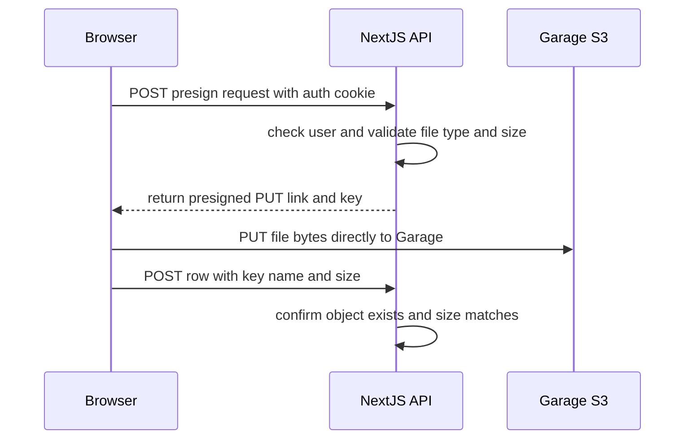

Attendance selfies (≤500 KB) skip presign and go server-side `multipart → PutObject`
(simpler; payload is tiny). Gallery (≤100 MB) and chat (≤20 MB) use the presigned-PUT flow
above so 100 MB videos never pass through Node.

### 2.3 View / download flow (broker proxy — permanent addresses)

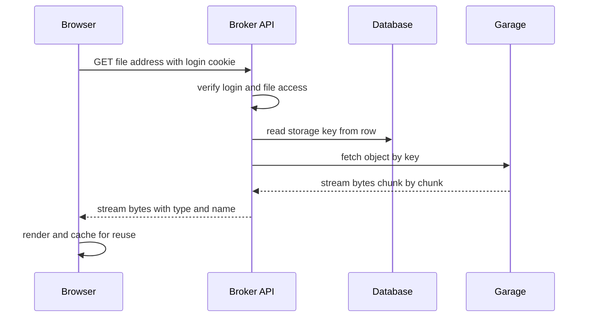

Memory per transfer is one small buffer (~64 KB) regardless of file size — chunks flow
through, nothing is ever held whole. `?download=1` adds save-with-filename headers;
`Range` requests are forwarded for video seeking.

### 2.4 Delete flow (count-before-destroy for chats)

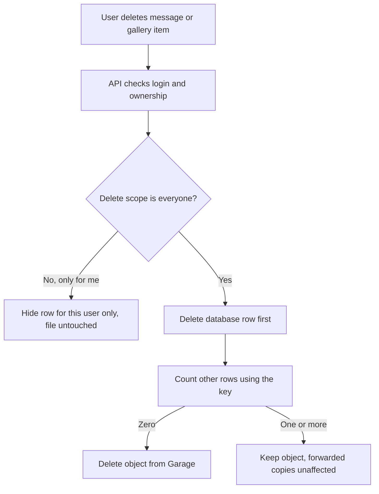

Deletes are **best-effort on storage, authoritative on Postgres** (same semantics as today's
`try { del() } catch {}` blocks). Gallery/attendance stay single-owner direct delete —
only chats share objects (full protocol in §8.4).

---

## 3. Why Garage (and not AWS S3 cloud / MinIO) — for the record

- **Garage vs AWS S3 cloud:** same API from our code's view. Difference is ops: AWS gives
  11×9s durability + off-site + egress bills + needs internet; Garage-on-Ubuntu is free,
  LAN-fast, works during internet cuts, but durability = that one disk (RF=1). Since the
  requirement is "everything on our office server", Garage is the consistent choice; keeping
  the S3 API means AWS stays available later without rewrites.
- **Garage vs MinIO:** both S3-compatible; Garage is the team's pick and is genuinely lighter
  for a single small node (one Rust binary, sqlite metadata, ~100 MB RAM idle), designed for
  flaky/small self-hosting (Deuxfleurs' own use case). Either would work — do not run both.
- **Single-node warning:** `replication_factor = 1` = no redundancy (per
  [Garage config ref](https://git.deuxfleurs.fr/Deuxfleurs/garage/src/branch/main-v1/doc/book/reference-manual/configuration.md)).
  Accepted because there is one box; mitigation = nightly volume backup off-box + plan a 2nd
  node later to raise RF without app changes.

---

## 4. What WILL be uploaded to S3 (complete inventory)

Every row = one migration unit. Object bytes are copied under **identical keys** Blob →
Garage so no remap table is needed. Row IDs (primary keys) are preserved by `pg_dump` and
never touched — broker addresses built from them work before, during, and after the move.

| # | What | Files / types | Size cap | Upload path today → target | S3 key pattern (server-generated) | DB columns holding it |
|---|---|---|---|---|---|---|
| U1 | Attendance selfies (check-in/out proof) | JPEG/PNG photo | 500 KB | `POST /api/attendance/upload-photo` (`upload-photo/route.ts:45` `put()`) → **server-side `PutObject`** | `attendance/{employeeId}/{IST-day}/{side}-{ts}-{rand8}.jpg` | `AttendanceRecord.checkInPhotoUrl/checkOutPhotoUrl`, `PhotoAttendanceRecord.checkInPhotoUrl/checkOutPhotoUrl` (`schema.prisma:556-557,661-662`) — values become **keys**, not URLs (backfill §9) |
| U2 | Customer gallery media | image (jpeg/png/webp/gif), video (mp4/mov/webm), doc (pdf/doc/docx/xls/xlsx) | 100 MB | `media/upload/route.ts` (`handleUpload`) + `customer-media-store.ts:102-109` `upload()` → **presigned PUT** (`POST .../media/presign`, new) | `customers/{customerId}/{ts}-{rand8}-{sanitizedName}` | `MediaAttachment.url + pathname` (`schema.prisma:59-73`); `pathname` already = key, reused as-is |
| U3a | Chat images (single + gallery batch) | jpeg/png/webp/gif | 20 MB total flow | `messages/upload/route.ts` + `customer-messages-store.ts:68-79,195-247` → **presigned PUT** (`POST .../messages/presign`, new) | `crm/{customerId}/{ts}-{rand8}-{sanitizedName}` | New `Message.imageKeys[]` (+ legacy `imageUrl/imageUrls` keep working via mirror) |
| U3b | Chat PDFs | pdf | 20 MB | same as U3a (`addPdfMessage`) | `crm/...` | New `Message.pdfKey` (+ legacy `pdfUrl`) |
| U3c | Chat voice notes | webm/mp4/mpeg (recorded Blob) | 20 MB | same as U3a (`addVoiceMessage`) | `crm/...` | New `Message.audioKey` (+ legacy `audioUrl`) |

Key rules (all new code): keys are generated **server-side at presign time** (never trust
client-built keys); the `{rand8}` segment replaces Blob's `addRandomSuffix` and closes the
same-millisecond collision hole; display names live only in row columns (`name`, `pdfName`),
never parsed out of keys. Volume note: gallery batches + multi-image chat sends upload **in
parallel** today (`Promise.all(files.map(uploadFile))`) and that parallelism is preserved
(parallel PUTs to distinct presigned links). Garage multipart covers the 20–100 MB tail.

### 4.2 What will NOT go to S3 (do not migrate / do not newly upload)

- Quote PDFs (client-side `html2canvas + jsPDF`, `lib/quote-export-zip.ts:399` `zip.generateAsync({type:"blob"})` → `URL.createObjectURL`) — ephemeral browser blobs, never stored.
- CSV exports (`lib/csv.ts:77` `new Blob(...)`) — generated per-click, never stored.
- Company logo (`branding-tab.tsx:25` `FileReader → logoDataUrl`, `quote-pdf-sheet.tsx:51` renders data-URL) — lives inside `QuoteTemplateSettings` JSON, not object storage. BACKEND.md §8.6 "logo upload" was never built — still out of scope.
- `LeaveRequest.attachmentUrl` (`schema.prisma:592`) — column exists, no upload flow writes it; leave it alone.
- Chat **text/system/reactions/stars** — Postgres rows, no bytes.

---

## 5. URLs: permanent broker addresses (no temporary links anywhere in views)

### 5.1 Today (Vercel Blob, public)

- One upload ⇒ one **permanent, public, unauthenticated** URL:
  `https://<store>.public.blob.vercel-storage.com/<key>-<random>`.
- Stored verbatim in Postgres (`MediaAttachment.url`, `Message.imageUrl…`, photo URL columns).
- Frontend renders it directly: ``, `fetch(/api/download?url=…)` proxies it.
- "Authorization" = obscurity (random suffix) + our broker routes that decide **who learns** the URL.

### 5.2 After (Garage private + app broker)

- Bucket is **private** and unreachable from browsers. There are no viewable Garage URLs at all.
- Every file has one **permanent broker address** built from IDs the database already owns:
  `/api/files/msg_<messageId>`, `/api/files/media_<mediaId>`, `/api/files/att_<recordId>`
  (+ `?side=checkIn|checkOut` for attendance, `?download=1` to force save-with-filename).
- The broker checks login + ownership (**every request**, via existing `requireUser()` /
  `getCurrentEmployee()`), reads the storage key from the row, streams bytes from Garage over
  loopback. Authorization lives in the app, exactly where it lives today.
- Consequences the junior must internalize:
  1. Store **keys** in Postgres, never any signed/temporary URL (only presigned PUT links
     exist, single-use at upload, 120 s, never stored).
  2. Screens render broker addresses; they never change, so the 4 s chat poll, gallery
     loading, and lightbox navigation need zero changes beyond swapping the `src` fields.
  3. Same file in two chats = same broker address = the **browser's own cache** serves the
     second view with zero re-download. No app RAM cache exists or is needed.
  4. Downloads force "Save as" via `Content-Disposition` on the `?download=1` variant.
  5. Copy-link buttons copy the broker address (permanent, login-gated).
  6. Clock skew (NTP) matters only for presigned PUT mints — `timedatectl set-ntp true` anyway.
- Escape hatch (documented, not built): if the box ever strains under video load, the broker
  may `302`-redirect video addresses to presigned GETs later with **zero client changes**.

---

## 6. Coolify deployment (Garage + Postgres + app)

### 6.1 Garage service

- Coolify → New **Service** → `Garage` (or custom Compose with `dxflrs/garage:v2.3.0` pinned).
- Env: `GARAGE_RPC_SECRET` (`openssl rand -hex 32`, same on all future nodes),
  `GARAGE_ADMIN_TOKEN` (`openssl rand -base64 32`),
  `GARAGE_DEFAULT_ACCESS_KEY` (`GK…`), `GARAGE_DEFAULT_SECRET_KEY`, `GARAGE_DEFAULT_BUCKET=modusys`.
  Single-node flags: `--single-node` (auto layout, RF=1).
- Persistent storage (Compose is source of truth; verify under Persistent Storages):
  `garage-meta → /var/lib/garage/meta`, `garage-data → /var/lib/garage/data` (named volumes;
  Coolify prefixes names with resource UUID — record actual names after first deploy).
- Ports: publish `3900` to LAN/Nginx only (never to the public internet); `3901` intra-box;
  `3903` → `127.0.0.1` only. Healthcheck: `GET :3903/health`.
- Init (exec in container): `garage key create modusys-app`,
  `garage bucket create modusys`, `garage bucket allow --read --write modusys --key modusys-app`,
  plus `garage bucket create modusys-staging` with the same allow for staging (§12).
  `PutBucketCors` for the app origin (`PUT` from browsers for direct uploads — else browser
  PUT fails CORS; reads need no CORS since they go through the broker).
- Pre-flight before migration day: `df -h` free space ≥ 3× Blob volume; NTP in sync;
  `aws s3 ls --endpoint-url <Garage>` works with the app key.

### 6.2 Postgres + app

- Postgres `17` Coolify database, volume `pg-data → /var/lib/postgresql/data`; nightly
  `pg_dump` off-box (volume ≠ backup). Neon → local is a separate `pg_dump | psql` + adapter
  swap (`PrismaNeon` → `pg` + `@prisma/adapter-pg` in `lib/server/prisma.ts`); file migration
  does not block on it.
- Next.js app: normal Coolify deploy; env gains `S3_*` (§8.3), loses `BLOB_READ_WRITE_TOKEN`.
  No local disk writes for uploads (bytes go browser → Garage), so the app needs no data volume.
- Cron `cleanup-old-photos` moves from `vercel.json` to a systemd timer / Coolify scheduled job
  calling the same route with `CRON_SECRET` (add a lock so overlapping runs can't double-delete).

---

## 7. Nginx (existing proxy) — exact role + required directives

Nginx terminates TLS and routes by host. The `s3.<domain>` block serves **browser-direct
PUT uploads only** (reads go through the app broker, never to Garage directly):

```nginx
# App (existing, unchanged except staying as-is)
# server_name app.<domain>; location / { proxy_pass http://nextjs:3000; ... }

# Garage S3 (PUT uploads from browsers)
upstream garage_s3 { server 127.0.0.1:3900; }

server {
  listen 443 ssl http2;
  server_name s3.<domain>;
  ssl_certificate /etc/letsencrypt/live/s3.<domain>/fullchain.pem;
  ssl_certificate_key /etc/letsencrypt/live/s3.<domain>/privkey.pem;

  client_max_body_size 110m;        # gallery max 100 MB + headroom
  client_body_timeout 120s;
  proxy_request_buffering off;      # stream PUTs, don't spool
  proxy_max_temp_file_size 0;
  proxy_http_version 1.1;

  location / {
    proxy_pass http://garage_s3;
    proxy_set_header Host $http_host;          # required: SigV4 signs host
    proxy_set_header X-Forwarded-For $proxy_add_x_forwarded_for;
    # DO NOT normalize/escape the query string — presigned SigV4 must arrive intact
  }
}
```

Pitfalls: stripping query args, lowercasing `%2F`, or buffering large PUTs all break uploads
with `SignatureDoesNotMatch` / timeouts. Test with one real presigned PUT before cutover.

---

## 8. Code changes required (file-level)

### 8.0 What problem each solution solves (read first)

| # | Problem (what was broken/missing) | Solution (what we do) | Detailed in |
|---|---|---|---|
| P1 | Forwarded chats share one file; deleting one message would destroy the others' copy | Count-before-destroy: row deleted first, file destroyed only at zero remaining references | §8.4 |
| P2 | File links would expire (temporary-link design) → stale/broken images, refresh machinery, RAM caches | Permanent broker addresses; no expiring links exist in the view path | §8.7 (model: §5) |
| P3 | Database has nowhere to store file addresses (chats/attendance hold only dead-after-migration links) | New address columns + one-time fill; old files' addresses recovered, new files' generated | §8.6, §9 |
| P4 | Filenames/downloads could break (encoding, wrong names, cross-origin save) | Exact-name copy + audit; `?download=1` broker variant; clipboard copies broker address | §8.5 Case 2, §13 E6/E12/E13 |

Rule for the junior: every change in §8 must cite its P-number. If a change serves no P-row, it doesn't belong in this migration.

### 8.1 New shared module (write first)

`lib/server/s3.ts` — sole owner of the SDK:

```ts
import { S3Client, PutObjectCommand, DeleteObjectCommand, HeadObjectCommand, GetObjectCommand } from "@aws-sdk/client-s3";
import { getSignedUrl } from "@aws-sdk/s3-request-presigner";
import { randomBytes } from "crypto";
export const s3 = new S3Client({ endpoint: process.env.S3_ENDPOINT, region: process.env.S3_REGION ?? "garage", forcePathStyle: true, credentials: { accessKeyId: process.env.S3_ACCESS_KEY_ID!, secretAccessKey: process.env.S3_SECRET_ACCESS_KEY! } });
export const Bucket = process.env.S3_BUCKET!;
// Server-side key minting: timestamp + randomness + sanitized name. Never trust client keys.
export function newKey(prefix: string, customerOrEmployee: string, origName: string) {
  const safe = origName.replace(/[^a-zA-Z0-9._-]+/g, "_").slice(0, 80) || "file";
  return `${prefix}/${customerOrEmployee}/${Date.now()}-${randomBytes(4).toString("hex")}-${safe}`;
}
export const presignPut = (Key: string, ContentType: string, size: number) => getSignedUrl(s3, new PutObjectCommand({ Bucket, Key, ContentType, ContentLength: size }), { expiresIn: Number(process.env.S3_PUT_EXPIRY ?? 120) });
export const getObject = (Key: string, Range?: string) => s3.send(new GetObjectCommand({ Bucket, Key, Range }));
export const headObject = (Key: string) => s3.send(new HeadObjectCommand({ Bucket, Key }));
export const putServerFile = (Key: string, Body: Buffer, ContentType: string) => s3.send(new PutObjectCommand({ Bucket, Key, Body, ContentType }));
export const deleteKey = (Key: string) => s3.send(new DeleteObjectCommand({ Bucket, Key }));
// Refcount-guarded delete for shared chat objects (protocol §8.4). Returns true if deleted.
export async function deleteKeyIfUnreferenced(Key: string) {
  const refs = await prisma.message.count({ where: { OR: [{ imageKeys: { has: Key } }, { audioKey: Key }, { pdfKey: Key }] } });
  if (refs > 0) return false;
  try { await deleteKey(Key); return true; }
  catch (e) { console.warn("[storage] deleteKey failed", Key, e); return false; }
}
```

New broker route `app/api/files/[ref]/route.ts` (spec): parse `msg_|media_|att_` prefix + id
(+ `?side=`, `?download=`); `requireUser()` (attendance: owner-or-super-admin rule mirroring
`attendance/photo/[recordId]/[type]`); load row → key → `getObject(Key, rangeHeader)` →
stream `Response` with `Content-Type` (stored type), `Content-Length`/`Content-Range`,
`Accept-Ranges: bytes`, `Cache-Control: private, max-age=3600`, and `Content-Disposition`
(`inline` default; `attachment; filename="<stored name>"` for `?download=1`). Forward the
client `Range` header verbatim. Never log keys at info level, never log URLs.

### 8.2 Per-route edits

| File | Today | Change to |
|---|---|---|
| `app/api/attendance/upload-photo/route.ts:2,45-50` | `put(key, file)` | `putServerFile(newKey("attendance", employee.id, side.ext), Buffer, mime)`; return `{ key }` (drop `url`) |
| `app/api/attendance/check-in/route.ts:46`, `check-out/route.ts:48` | rejects non-`*.public.blob.vercel-storage.com` | validate `key` prefix `attendance/{employeeId}/` + ext; optional `headObject` confirm |
| `app/api/customers/[id]/media/upload/route.ts` (`handleUpload`) | Blob token issuer | **Replace** with `POST .../media/presign` → server mints `newKey("customers", customerId, name)`, returns `{ putUrl, key }` after auth + 100 MB allowlist check |
| `app/api/customers/[id]/messages/upload/route.ts` (`handleUpload`) | Blob token issuer | **Replace** with `POST .../messages/presign` → same pattern, 20 MB allowlist |
| `lib/store/customer-media-store.ts:102-109` | `upload(pathname, file, {handleUploadUrl})` | `fetch(presign) → PUT putUrl → POST .../media {key, name, size}` (parallel as today; key comes from server, not client) |
| `lib/store/customer-messages-store.ts:68-79` | same via `upload()` | same PUT pattern for voice/image/pdf (keep `Promise.all` batch) |
| `app/api/customers/[id]/media/route.ts:32-44` | requires `{url, pathname, name}` | require `{key, name}`; `headObject` confirm (exists + size match) then create row with `pathname = key`, `url = ""` (legacy col retired later) |
| `app/api/customers/[id]/messages/route.ts:47-67` | stores `audioUrl/imageUrl(s)/pdfUrl` | store `audioKey/imageKeys/pdfKey` (+ keep legacy URL cols populated from Blob URLs until cutover; post-cutover rows carry keys in the new cols). Preserve `imageUrl = imageUrls[0]` mirror invariant for keys |
| `app/api/customers/[id]/media/[mediaId]/route.ts:24` | `del(pathname)` | `deleteKey(pathname)` — arg unchanged (single-owner, no sharing) |
| `app/api/attendance/my-photos/[recordId]/route.ts:34,49`, `cron/cleanup-old-photos/route.ts:30` | `del(url)` | resolve key (new rows already keys; old via backfill map) → `deleteKey(key)` |
| `app/api/attendance/photo/[recordId]/[type]/route.ts:44` | `redirect(storedUrl)` | redirect to broker address (or fold into broker; keep auth rule) |
| `app/api/download/route.ts:16` | `fetch(url)` proxy of Blob URL | accept `?ref=` broker address (or retire in favor of broker `?download=1`); delete `?url=` Blob path after cutover |
| `app/api/customers/[id]/messages/[messageId]/route.ts:66-77` | row delete, blob orphaned | row-first, then `deleteKeyIfUnreferenced()` per key (protocol §8.4); `scope=me` path untouched |
| `app/api/customers/[id]/messages/[messageId]/route.ts:23-38` | `removeImageIndex` splices URLs, never touches storage | capture removed key → apply splice/row-delete → `deleteKeyIfUnreferenced()` on it |
| `forward/route.ts:37-44` | copies URL fields | copy **key** fields (`audioKey/imageKeys/pdfKey`); zero storage ops |
| Renderers `message-bubble.tsx:48,246-254,606-721`, `media-gallery.tsx:131,135`, `media-lightbox.tsx:55,100,105,109`, `activity-feed.tsx:33,282`, `message-input.tsx:216`, `admin-photo-thumb` | raw `src={url}` / `href={url}` | broker addresses from serializer view fields; downloads via `?download=1`; clipboard copies broker address |
| `lib/server/serialize.ts:99-125,127-138` | passes raw Blob URLs | `serializeMessage` emits broker addresses (`msg_<id>`) + names; `serializeMediaAttachment` emits `media_<id>` addresses. No expiry fields anywhere |

### 8.3 Deps + env

- `npm rm @vercel/blob && npm i @aws-sdk/client-s3 @aws-sdk/s3-request-presigner`
  (DB move separately: `npm rm @neondatabase/serverless @prisma/adapter-neon && npm i pg @prisma/adapter-pg`).
- Delete `BLOB_READ_WRITE_TOKEN`. Add: `S3_ENDPOINT=https://s3.<domain>`,
  `S3_BUCKET=modusys`, `S3_REGION=garage`, `S3_ACCESS_KEY_ID`, `S3_SECRET_ACCESS_KEY`,
  `S3_FORCE_PATH_STYLE=true`, `S3_PUT_EXPIRY=120`. No write-target flags of any kind.

### 8.4 Shared-object delete protocol (chat attachments)

Chat attachments are **shared by reference**: forwarding copies the file reference into the
new row without re-uploading (`forward/route.ts:29-51`). N rows may point at one stored
object. Gallery and attendance photos are single-owner and keep direct `deleteKey` — this
protocol is chat-only.

**Algorithm (implemented in `deleteKeyIfUnreferenced`, §8.1):**

1. Collect the row's distinct keys *before* touching anything.
2. Delete (or update, for `removeImageIndex`) the database row **first**.
3. For each key: count remaining `Message` rows referencing it in `imageKeys[]`, `audioKey`,
   `pdfKey`. Zero → `DeleteObject` (404 swallowed + logged with key + message id). Non-zero → skip.
4. `?scope=me` (including forced non-owner scope) performs **zero** storage operations.

**Ordering law: row first, count second.** Counting before deleting races: two simultaneous
deletes of the last two references would both see count=1 and both skip → orphan. Row-first
ordering makes the worst race outcome a leftover orphan — never a broken surviving message.
Orphans are reported by the audit (§9) and cleaned in post-migration ops, never a gate.

| Edge case | Behavior under this protocol |
|---|---|
| Forward chain (forward of a forward, any depth) | All copies render; deleting any subset keeps the rest (guard counts all rows) |
| Original deleted before the forwarded copy (and reverse) | Survivor unaffected; object dies with the last reference |
| Last image removed via `removeImageIndex` | Row deleted (existing behavior) + removed key goes through the helper |
| Two users delete the last two references simultaneously | Row-first ordering → orphan at worst, never loss |
| `scope=me`, non-owner delete (forced `me`), text-only delete | Zero storage ops by construction |
| Super-admin deleting others' rows (`everyone`-scope) | Same guarded path |
| Voice/PDF forwards | Same rule across `audioKey`/`pdfKey`, not just images |
| Key already absent in Garage | 404 swallowed + logged; request still succeeds |
| Freeze window | No deletes occur (writes frozen); protocol governs live traffic only |

### 8.5 File lifecycle: before vs after (per case, with diagrams)

#### Case 1 — Upload

BEFORE (Blob): browser asks API for token → API checks login/rules → browser PUTs bytes
direct to Blob → Blob returns permanent public link → browser saves row with link. Chat key
built client-side (`crm/...`, `customer-messages-store.ts:72`); Blob's `addRandomSuffix`
guaranteed uniqueness. Gallery identical with progress bar (`customer-media-store.ts:102-109`).
Attendance selfies go *through* the server (`put()`, `upload-photo/route.ts:45`).

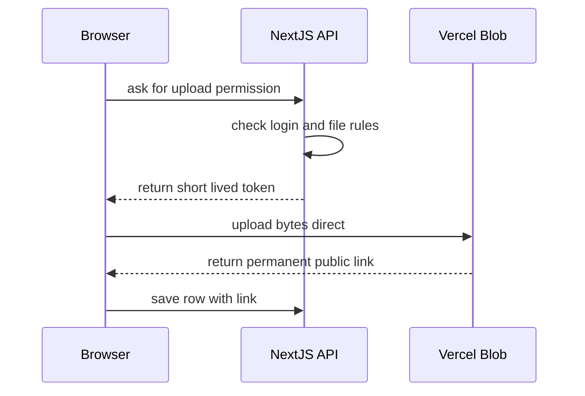

AFTER (Garage): identical shape, three differences — (1) presign endpoint mints the **key
server-side** with random segment (§8.1 `newKey`); (2) row-POST runs `headObject` confirm
(exists + size match) before writing; (3) attendance path returns `{key}` only. Parallel
batches, progress bar, and optimistic previews (`URL.createObjectURL`, replaced on success)
are unchanged.

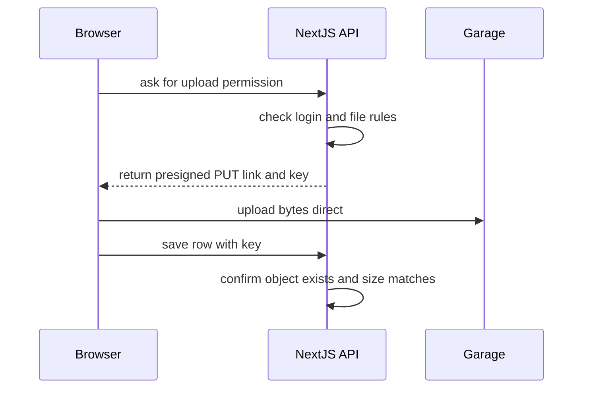

**User-visible invariant:** picker → progress → message appears with preview, same timing/order.

#### Case 2 — View / download

BEFORE: screen renders stored permanent link; browser fetches from Blob with no auth at fetch
time. Works in ``, `<video>`, `<audio>`, PDF frame, download anchors, copy-link.

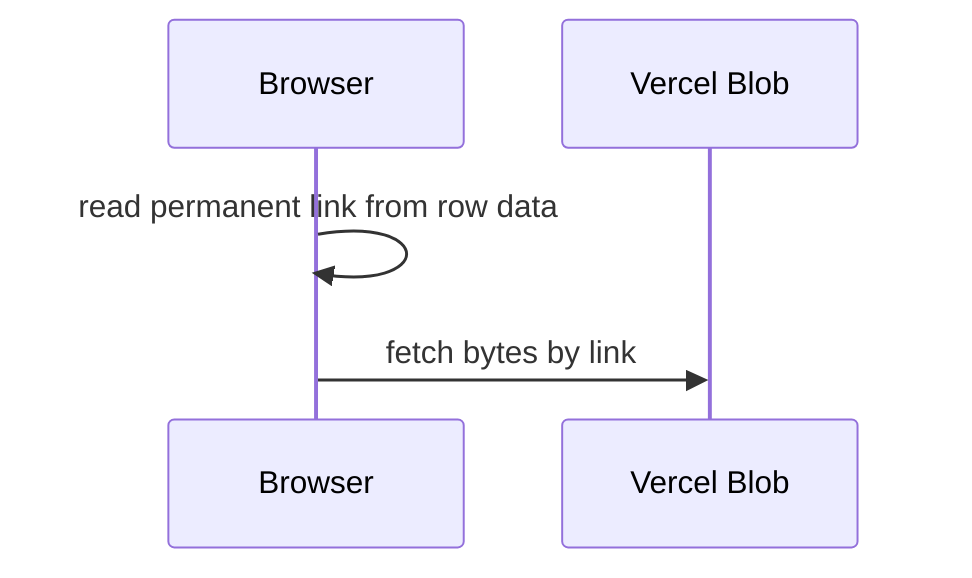

AFTER: screens render permanent broker addresses from serializer fields; broker auth-checks,
looks up the key, streams bytes (diagram §2.3). PDFs keep today's exact behavior
(button `message-bubble.tsx:604-627` → modal → frame streams progressively `:686-690`,
nothing force-downloaded; mobile share-sheet fetch `:648-657` runs against the same-origin
broker with cookie). Gallery documents stay download-link-only (`media-lightbox.tsx:107-112`).
Same file in two chats = same broker address = browser cache serves the second view free.

**User-visible invariant:** every thumbnail, player, preview, and download pixel-identical.

#### Case 3 — Delete (when does a file actually die?)

BEFORE: gallery delete removed the object (`del(pathname)`); chat delete removed only the
row — **files never died** (every deleted chat attachment still sits in Blob; the copy step
carries these orphans along deliberately so counts reconcile).

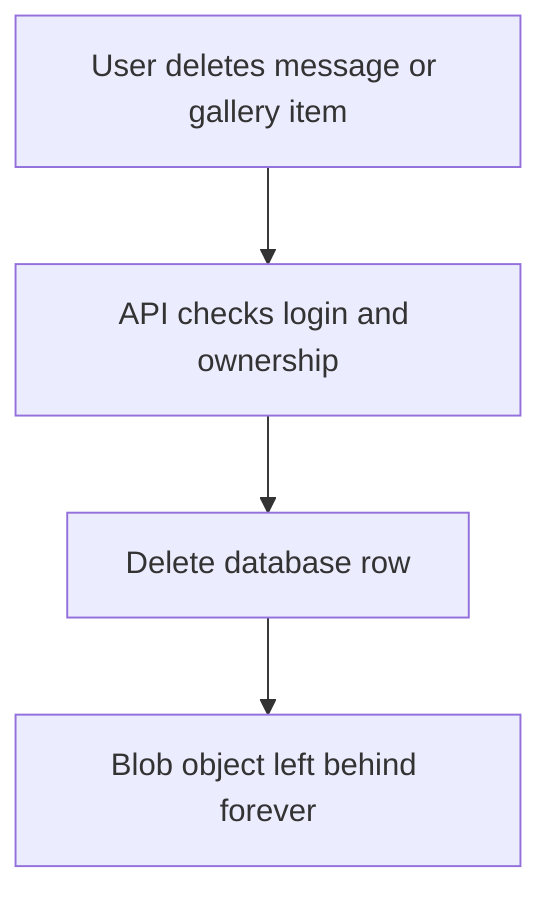

AFTER: guarded chart (§2.4 / §8.4) — row first, count second, destroy at zero; `me`-scope
untouched; `removeImageIndex` covered. **User-visible invariant:** deletes look exactly as
today; forwarded copies never break.

#### Case 4 — Forward

BEFORE: API copies link fields into the new row (`forward/route.ts:37-44`); zero bytes moved;
reply/reactions excluded (fresh message, WhatsApp-style).

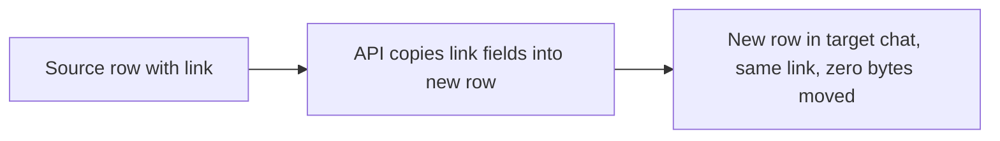

AFTER: identical, key fields copied instead of link fields; zero storage ops; multi-target
fan-out unchanged.

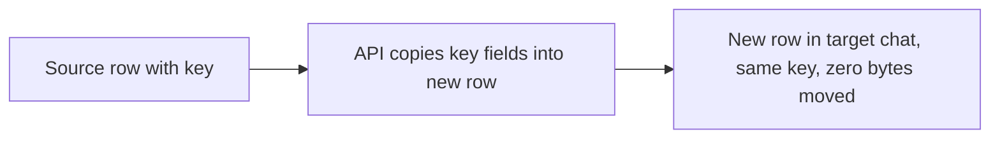

**User-visible invariant:** forwarding is instant (no re-upload wait), exactly as today.

### 8.6 File addresses: recovered for old files, generated for new ones (solves P3)

**Problem restated (P3):** chats (`Message`) and attendance photo columns store only full Blob
links, which die with the Blob store; no column holds a storage address. Gallery is exempt —
`MediaAttachment.pathname` (`schema.prisma:66`) already is the address.

**Old files — addresses are RECOVERED (never generated):**

1. Gallery: read `pathname` per row directly (it is already the exact key — proven by the
   gallery delete path passing it straight to Blob's delete).
2. Chats/attendance: build the lookup set from Vercel's `list()`; per row, strip the link to
   its path part and confirm membership in that set; write to the new column (`audioKey` /
   `imageKeys[]` / `pdfKey`; attendance key columns). No match → null + flagged row (renders
   existing removed-file state).
3. Legacy scalar-only image rows normalized scalar→array first (mirror invariant,
   `schema.prisma:92-94`); forwarded rows resolve to the same address independently.
4. Non-nullable `PhotoAttendanceRecord.checkInPhotoUrl` (`schema.prisma:661`): any unresolved
   row *stops* the migration — rehearsal must show zero.

**New files — addresses are GENERATED by `newKey()` (§8.1):**
`prefix/owner/ts-rand8-sanitizedName`, server-side at presign time. The `{rand8}` replaces
Blob's `addRandomSuffix` (closes same-millisecond collisions); display names live only in row
columns, never parsed from keys.

**Why old files are NOT renamed into the new shape:** renaming = second move of every byte +
second remap chance, zero functional benefit — the broker treats addresses as opaque strings.
History stays verbatim; uniformity starts at cutover.

**Rollback property:** all of the above is additive (new columns, copied bytes, untouched old
columns/URLs) — the previous build stays bootable until day-14 decommission.

### 8.7 Permanent broker addresses (solves P2) — full implementation detail

**Problem restated (P2):** if browsers talked to Garage directly, every view would need an
expiring signed link — bringing stale/broken images, background refresh machinery, link
tables, and RAM caches. This design removes the entire problem class: browsers never contact
Garage. They use permanent broker addresses served by our app (model: §5). The only temporary
links left in the system are single-use presigned PUTs minted at upload time (120 s, never
stored) — uploads are actions, not views, so expiry there is a retry, never a broken screen.

**The broker route (new file `app/api/files/[ref]/route.ts`) — step by step:**

1. Parse `ref`: `msg_<messageId>` | `media_<mediaId>` | `att_<recordId>`, plus `?side=` for
   attendance and `?download=` for forced save. Unknown prefix → `400`.
2. Auth: `requireUser()` for chats/gallery (existing ownership = any logged-in user, matching
   today's open Blob URLs gated only by obscurity — strictly tighter now); attendance keeps the
   owner-or-super-admin rule mirroring `attendance/photo/[recordId]/[type]/route.ts`.
3. Load the row → read its address column (`imageKeys/audioKey/pdfKey`, `pathname`, photo key).
   Row or key missing → `404` → existing removed-file UI (never a 500, never a hang).
4. `getObject(Key, clientRangeHeader)` over loopback; stream the response body chunk-by-chunk
   (~64 KB buffer; whole files are never held in memory).
5. Headers on every response: stored `Content-Type` (set explicitly, never sniffed),
   `Content-Length`/`Content-Range`, `Accept-Ranges: bytes`, `Cache-Control: private,
   max-age=3600`; `Content-Disposition: inline` default, `attachment; filename="<stored name>"`
   for `?download=1`. Forward the client's `Range` verbatim; answer `HEAD` via `headObject`.
6. Never log addresses or URLs; log only row id + outcome on failures.

**Per-consumer migration (exhaustive — every line that renders a file):**

| Consumer | Today | After |
|---|---|---|
| `message-bubble.tsx:48` voice player | `src={audioUrl}` Blob link | broker `msg_` address; streams identically |
| `message-bubble.tsx:718-721,907` image galleries | raw links | broker addresses; same gallery/lightbox code |
| `message-bubble.tsx:687` PDF frame | `src={pdfUrl}` | broker address; frame streams progressively as today (`:604-690` modal flow untouched) |
| `message-bubble.tsx:661` open-in-tab, `:294,649` downloads | direct link / `?url=` proxy | broker address / `?download=1`; mobile share-sheet fetch (`:648-657`) runs same-origin with cookie |
| `message-bubble.tsx:263` copy-link | copies permanent link | copies permanent broker address (login-gated) |
| `activity-feed.tsx:33,282` chat-wide lightbox | raw links | serializer view fields (broker addresses) |
| `message-input.tsx:216` reply preview | raw links | same serializer fields |
| `media-gallery.tsx:131,135` thumbs, `media-lightbox.tsx:55,100,105,109` full/downloads | raw `item.url` | broker `media_` addresses; documents stay download-link-only (`:107-112`), videos keep controls+autoplay |
| Attendance photo views, `admin-photo-thumb` | Blob links via photo broker | broker `att_` addresses; role rule unchanged |
| `serializeMessage` (`serialize.ts:99-125`), `serializeMediaAttachment` (`:127-138`) | pass raw Blob URLs | emit broker addresses + names; no expiry fields anywhere |

**Why no RAM cache, no refresh timers, no link table:** the same file has the same permanent
address in every chat, so the browser's own HTTP cache serves repeat views with zero
re-download and zero app code. The 4 s chat poll re-renders identical addresses (no flicker,
no refetch). PDF frames stream pages as viewed and discard on close (verified current
behavior) — nothing is ever force-held in memory. Videos are excluded from nothing because
there is no cache to exclude them from; they stream with `Range` like any other bytes.

**Rejected alternatives (documented so nobody re-litigates):** presigned GET with hourly
refresh (reintroduces the exact bug class P2 removes); app RAM blob-cache (worse than today's
streaming, risks low-RAM devices); duplicating files per forward (unrelated to serving, and
rejected under P1). Escape hatch only: if the box ever strains under video load, the broker
may `302` video addresses to presigned GETs with zero client change.

---

## 9. Data migration: Blob → Garage in a 30–45 min freeze window

Data is < 10 GB (possibly < 1 GB) — copy time is minutes, measured exactly by rehearsal.

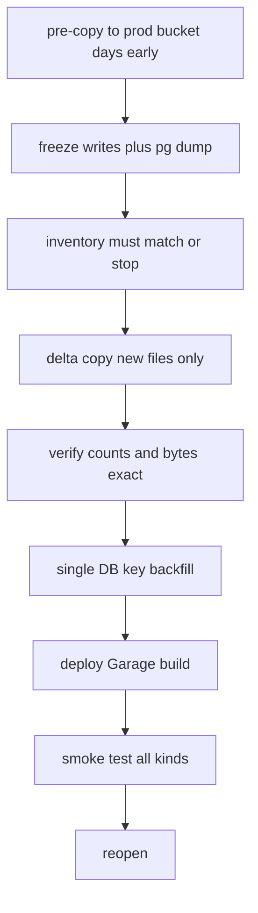

1. **Pre-copy (days before, app live, zero risk):** `scripts/migrate-blob-to-garage.ts` paginates
   Blob `list()`, streams `GET blobUrl → PutObject` under **identical keys** with original
   content types (concurrency 8, retry 3×, per-file log `{key, bytes, etag}`). The prod Garage
   bucket is invisible to the live app, so this is safe at any hour. Time it — this number
   fixes the window. Optional: first run targets `modusys-staging` to shake down the script.
2. **Freeze (window start, ~2 min):** maintenance page on in Nginx (or stop Next.js service);
   confirm zero writes; `pg_dump` snapshot (rollback material #1).
3. **Inventory (~2 min):** Blob `list()` vs `SELECT count(*)` on `MediaAttachment`, `Message`
   (any attachment col non-null), both attendance tables. Mismatch ⇒ stop, reconcile.
4. **Delta copy (minutes):** re-run script — only files added since pre-copy move. Idempotent
   same-key overwrite; resume from log file, never from scratch.
5. **Verify (~5 min):** `ListObjectsV2` count + byte sum **exactly equal** Blob inventory (no
   "± new writes" — writes are frozen). Spot-`HeadObject` 10 random keys. Then per-row audit:
   every attachment reference resolves to exactly one object; missing/orphan report must show
   zero missing (orphans informational only).
6. **Backfill (~3–5 min):** one Prisma migration adds `Message.audioKey/imageKeys[]/pdfKey`
   (nullable); single `UPDATE` fills keys by matching old URLs against the Blob inventory
   (handles encoding exactly; preserves `imageUrl = imageUrls[0]` mirror for keys). Additive —
   the old build would still boot if rollback is ever needed.
7. **Deploy cutover build (~5–10 min):** §8 code with single `S3_*` env. No Blob vars, no flags.
8. **Smoke test (~5–10 min, §10 chat checklist included)** → reopen (lift maintenance page).
9. **Decommission (day 14, clean):** object count = Blob count + new writes; delete Blob store.
   Rollback before then = redeploy previous image (+ snapshot restore only if the backfill
   itself is suspect — normally just redeploy, old columns intact).

---

## 10. Verification matrix (Definition of Done)

- [ ] Presigned PUT works through Nginx for 500 KB selfie, 20 MB chat PDF, 100 MB gallery video
- [ ] Broker renders: gallery thumbs + lightbox, chat image/voice/PDF, attendance photos, activity-feed lightbox, reply previews
- [ ] Same PDF in two chats downloads once (browser cache; verify via devtools network)
- [ ] Video seek works (206 responses); `?download=1` saves with real filename on desktop + mobile share
- [ ] Copy-link gives permanent broker address; logged-out open redirects to login
- [ ] Forward attachment → delete original (everyone) → copy still renders **and** downloads
- [ ] Delete all copies → `HeadObject` 404; `scope=me` delete → object intact for others
- [ ] Remove last image via `removeImageIndex` → row gone + object gone
- [ ] Wrong-user presign/read returns 401/403 (auth per request proven)
- [ ] Cron dry-run deletes old Garage photos + rows; counts exact: `ListObjectsV2` == Blob list; byte sums match
- [ ] Maintenance page up/down performed; reopen only on zero-missing audit
- [ ] NTP in sync; CORS allows app origin PUT; `:3903` unreachable publicly
- [ ] Nightly Postgres + Garage volume backups exist off-box and one restore was tested

---

## 11. Risks & mitigations

| Risk | Mitigation |
|---|---|
| RF=1 disk loss | Nightly off-box backup of both volumes; add 2nd node → RF=2/3 later, no app change |
| Copy overruns the window | Rehearsal times it; abort threshold = 30 min in, rollback = redeploy + lift maintenance |
| SigV4 `SignatureDoesNotMatch` on PUTs via Nginx | Keep query intact, `Host $http_host`, path-style; pre-cutover PUT test (§7) |
| CORS blocks browser PUT | `PutBucketCors` before frontend swap; verify preflight in devtools |
| Broker load from video streaming | Same-box loopback is cheap; measure in staging; documented escape hatch (302-to-presigned for videos only, zero client change) |
| `Range` mishandled | Forward verbatim + test seek in staging; fallback = full-stream (works, just no seeking) |
| Orphaned chat blobs (existing bug) | Fixed by §8.4 going forward; migration copies existing orphans so counts reconcile; separate cleanup later |
| Scope creep (logos, quote PDFs into S3) | Explicitly out (§4.2) — separate proposal if ever needed |

---

## 12. Staging on Tailscale (no public DNS needed)

The office server is tailnet-only (public TCP times out by design). Staging therefore lives
entirely inside Tailscale — which is sufficient to prove everything, since the app's users
are the office team.

1. **Access:** office admin invites each tester's Google account to the tailnet; testers
   install Tailscale (laptop + phone app) and log in. Server appears on its tailnet name.
2. **Staging stack on the same box (Coolify):** staging Next.js build (Garage code) +
   Postgres restored from a **snapshot** (never the live DB) + `modusys-staging` bucket
   (same allow pattern as prod). Staging must never touch prod bucket/DB/Blob.
3. **Staging test matrix:** full §10 checklist against staging, with special attention to
   longest real chat thread (presign-free rendering under load is trivially fine — assert it),
   100 MB video upload + seek over tailnet, and one full forward→delete→verify sequence.
4. **Rehearsal copy** (no subdomain, no staging app needed): run the copy script into the
   staging bucket from any tailnet machine; record wall time and any 404/edge rows.
5. **Optional public staging later:** only if outsiders must test without Tailscale — add
   Tailscale Funnel or Cloudflare Tunnel (outbound from server, no static IP/router changes),
   then point a `staging.*` record at it. Never point a production-traffic subdomain at staging.

---

## 13. Master edge-case catalog (cause → fix → verify)

How to read: each row is one thing that goes wrong if unhandled (Cause), the exact
countermeasure (Fix — with code location), and how the junior proves it (Verify). Nothing
here is optional.

### 13.1 Upload-time

| # | Edge case | Cause if unhandled | Fix | Verify |
|---|---|---|---|---|
| E1 | Same name + same millisecond uploads | Identical keys → later PUT silently overwrites earlier file; one message shows the wrong photo | Server-side `newKey()` with `{rand8}` (§8.1); clients never build keys | Unit-test `newKey` uniqueness over 10k rapid calls; staging double-upload drill |
| E2 | Upload bytes land, row POST fails (network drop) | Orphan object, no row — harmless but counts drift | Accept + report: copy/audit tolerates orphans; periodic orphan report post-migration | Audit shows orphan, zero missing; app never renders it |
| E3 | Row POST references missing key (aborted upload) | Message with dead file renders broken forever | `headObject` confirm in row POST; reject mismatch → client existing send-failed UI → retry | Staging: kill network mid-PUT, confirm error state, retry succeeds |
| E4 | Client lies about size/type | Oversize/blocked content in bucket | Presign allowlist gates mint; `headObject` size gates row; serve uses stored content type | Staging: tampered presign request rejected; oversize PUT rejected at row POST |
| E5 | 100 MB video stalls | Partial object; user stuck | Retry full PUT (same link while valid, fresh mint after 120 s); progress bar resets honestly | Staging: throttled-network upload drill |
| E6 | Unicode/spaces/`+`/`%` in filenames | Key/URL mismatch → 404 on serve | Keys verbatim + server sanitize for the random segment only; display name stored separately in row cols | Upload `फोटो final (2).pdf`; view + download keep exact name |
| E7 | Presigned PUT expires (120 s) before slow upload starts | `403 ExpiredToken` mid-flow | Mint on demand per upload action (not prefetched); on expiry error, re-mint once and retry automatically | Staging: wait out expiry, upload still succeeds |
| E8 | CORS preflight failure on direct PUT | Browser blocks all chat/gallery uploads with opaque error | `PutBucketCors` (PUT,GET,HEAD + app origin) before frontend swap; surface backend message on failure | Devtools: preflight 200; failing case shows actionable toast |
| E9 | Nginx body limits on PUT path | `413` on large videos | `client_max_body_size 110m` (§7) | Staging 100 MB upload through Nginx |
| E10 | Attendance selfie > 500 KB / wrong type | Server `PutObject` of junk | Keep existing 500 KB + JPEG/PNG checks server-side before `putServerFile` | Existing validation untouched; staging oversize drill |

### 13.2 Serve-time (broker)

| # | Edge case | Cause if unhandled | Fix | Verify |
|---|---|---|---|---|
| E11 | Video seek | Player stalls; no seeking | Forward `Range` verbatim; return `206` + `Content-Range`; `Accept-Ranges: bytes` always | Staging: seek 100 MB video to 80% |
| E12 | `download` attribute ignored | File opens with junk name instead of saving | `?download=1` sets `attachment; filename="<stored>"`; desktop anchor + mobile share-sheet both use it | Download PDF/image/voice on desktop + Android/iOS; names exact |
| E13 | Copy-link rots | Pasted link dies (the presigned failure mode) | Clipboard copies broker address (permanent, login-gated) | Paste in fresh browser → login → file opens |
| E14 | Logged-out / wrong-customer access | Data leak or confusing error | `401` → login; `403` before touching Garage (existence not leaked) | curl without cookie → 401; other-customer id → 403 |
| E15 | Object missing in Garage | Broker 500 / hang | Map to `404` → existing removed-file UI; log key + row id | Delete object manually in staging; message shows removed state, app stable |
| E16 | Wrong content type served | PDF downloads instead of previewing (or vice versa) | Store content type at upload; set explicitly on every response; never sniff | Each U1–U3c type renders in its correct viewer |
| E17 | Long chat threads (50+ attachments) | Perf worry | No per-row crypto beyond DB read; broker streams on demand; threads render from rows, bytes only for visible media | Open longest real thread in staging; assert no lag |
| E18 | Gallery lightbox prev/next across mixed states | Index drift onto uploading/error items | Keep existing `viewableItems` (done-only) logic; broker addresses flow through the same items | Staging: navigate full gallery incl. a mid-upload item |
| E19 | Reply preview + activity-feed lightbox | Stale/dead thumbs | Both consume serializer view fields (broker addresses) — same as bubbles | Reply to image + open chat-wide lightbox in staging |
| E20 | HEAD requests / link prefetchers | Broken previews in some clients | Broker answers `HEAD` via `headObject` (length + type, no bytes) | curl `-I` on broker address |

### 13.3 Delete-time

| # | Edge case | Cause if unhandled | Fix | Verify |
|---|---|---|---|---|
| E21 | Forwarded copy deleted (either side first) | Survivor breaks (the critical bug) | §8.4 guard: row-first, count-second, destroy at zero | Forward → delete original → copy renders + downloads; then delete copy → object gone |
| E22 | Forward chains 3+ deep | Same as E21 at depth | Guard counts all rows; no depth limit in query | Three-hop forward drill in staging |
| E23 | Last image removed via `removeImageIndex` | Row deleted (existing) but object orphaned | Removed key through the helper (§8.2) | Remove images one by one; last removal drops row + object |
| E24 | Simultaneous deletes of last two references | Both skip (count-first) or double-delete | Row-first ordering (§8.4 law): worst case orphan, never loss; `DeleteObject` idempotent anyway | Code review asserts order; load-test double-click delete |
| E25 | `scope=me` / non-owner / text-only deletes | Accidental storage ops | Zero storage calls on these paths by construction | Delete-for-me → object intact for others |
| E26 | Super-admin deleting others' rows | Bypasses owner check | Same guarded everyone-path; ownership check is about permission, guard is about references | Staging drill as super-admin |
| E27 | Gallery optimistic delete fails server-side | Item vanishes locally but exists remotely | Existing rollback (`deleteFile` refetches on failure) works unchanged — broker errors are API errors like before | Staging: force 500, confirm item reappears |
| E28 | Attendance check-in photo delete drops whole row + checkout photo | Second object orphaned | Existing flow already best-effort-deletes both (`my-photos/[recordId]`) — keep both `deleteKey` calls | Drill: delete check-in side, assert both objects gone |
| E29 | Cron overlapping runs / huge backlog | Double-delete races, timeouts | Timer lock (single-flight) + paginate + continue-on-error with per-row log | Staging: backdate 200 rows, run twice concurrently |

### 13.4 Forward-time

| # | Edge case | Cause if unhandled | Fix | Verify |
|---|---|---|---|---|
| E30 | Forward of message with dead key | Copy renders broken (looks like migration broke it) | Consistent removed-state in copy (same as source) — by design, not data loss; audit flags source pre-migration | Forward a known-dead item in staging; both show removed state |
| E31 | Multi-target fan-out partial failure | Half the chats get the forward | Keep existing `Promise.all` semantics (all-or-error like today); do not "improve" mid-migration | Staging: forward to 3 chats incl. one invalid id; behavior matches prod today |
| E32 | Forward of voice note | Duration/name lost | Key + `durationSec` + name all copied (extend forward field list to key cols) | Forward voice; duration + playback identical |

### 13.5 Migration-time

| # | Edge case | Cause if unhandled | Fix | Verify |
|---|---|---|---|---|
| E33 | DB row points to already-gone Blob (best-effort `del` history) | Copy script crashes the run | Download 404 → log key + row, continue; app treats as removed media | Rehearsal report lists them; count matches audit missing-list exactly |
| E34 | Zero-byte objects | Size check `> 0` false-alams | Copy + log; no special-casing | Present in verify counts |
| E35 | Legacy mirror rows (`imageUrl` set, `imageUrls` empty) | Backfill misses array, new code reads empty gallery | Backfill normalizes scalar → `[scalar]` for both URL and key cols | Audit covers both cols; staging legacy message renders gallery |
| E36 | Empty-string / null URL cells | Crash on URL parse | Skip + log; never `new URL("")` unguarded | Rehearsal log clean |
| E37 | Interrupted copy run | Restart-from-zero wastes the window | Resume from per-key log file; same-key overwrite idempotent | Kill script mid-run in rehearsal; resume completes exactly |
| E38 | Blob `list()` pagination / throttling | Truncated inventory → false "verified" | Paginate fully with backoff; inventory count cross-checked vs DB counts before copy starts | Inventory step aborts on mismatch |
| E39 | Garage disk fills mid-copy | Partial bucket, failed PUTs | Pre-flight `df` ≥ 3× volume (§6.1); abort threshold in script; PUT retry surfaces `SlowDown`/531 clearly | Rehearsal on same disk proves headroom |
| E40 | IDs change in restore | Broker addresses die | `pg_dump` preserves PKs; post-restore assert row counts + spot-check 20 known IDs | Part of DB cutover checklist |

### 13.6 Ops-time (after reopen)

| # | Edge case | Cause if unhandled | Fix | Verify |
|---|---|---|---|---|
| E41 | Coolify redeploy loses data | Volumes mis-mounted | Mounts are Compose source of truth; post-deploy assert `ListObjectsV2` count + spot `HeadObject` | After every redeploy until routine |
| E42 | Secrets rotation (Garage key, admin token) | App + Garage disagree → all storage ops 403 | Rotate Garage-side first, then app env, then redeploy; keep old key valid during the window | Staging rotation drill |
| E43 | Broker CPU under concurrent video load | Slow streams on office box | Measure in staging; escape hatch documented (§5): 302-to-presigned for videos only, zero client change | Load drill: 10 concurrent video plays |
| E44 | Clock skew | Presigned PUT mints fail | NTP on box + Coolify host (`timedatectl set-ntp true`) | `timedatectl` check in pre-flight |

---

## 14. Production public exposure (gates cutover, runs in parallel)

**Current fact:** the office server is private — public TCP times out; it answers Tailscale
only. The migration itself (§9) needs no public reach, but reopening to real users does.

**What must be publicly reachable (and what must not):**

| Hostname | Serves | Public? |
|---|---|---|
| `app.<domain>` | Pages + API + file broker (views/downloads) | Yes — users open it in browsers |
| `s3.<domain>` | Browser-direct upload PUTs only | Yes — uploading browsers must reach it |
| Garage `:3900` directly, `:3903` admin, Postgres `:5432` | Internal | Never public |

One mechanism covers both public hostnames (tunnel or port-forward → Nginx routes by host).

**Why exposure is effectively required (not optional polish):** field attendance check-ins run
on public mobile data (`my-attendance-widget`: GPS + selfie upload). Private-only would force
the Tailscale app on every field phone, every day — battery killers and forgotten reconnects
silently break check-ins. Same for WFH/traveling staff and any external viewer. Private-only
reduces the system to office-and-tailnet; current production is public on Vercel, so that
would be a regression.

**Options:**

- **A. Cloudflare Tunnel (recommended):** outbound-only daemon on the server, no router or
  static-IP work, free; carries both hostnames with TLS. Caveat: bytes transit Cloudflare's
  edge — confirm acceptable (TODO-O1).
- **B. Router port-forward + DNS A + Let's Encrypt on Nginx:** no third party in path; needs
  static IP or DDNS plus on-site router access.
- **C. Tailscale Funnel:** fastest to try, tailnet-admin controlled; evaluate against company
  policy before relying on it for production.

**Ordering with the migration (two tracks, one meeting point):**

| Track | Works over | Gate |
|---|---|---|
| A. Migration prep (Garage, copy, backfill, broker code, Tailscale staging proof) | Tailscale — unblocked now | None |
| B. Exposure (tunnel/port-forward, DNS, TLS, public smoke test) | Office egress — anytime in parallel | Must finish before cutover day |

Reopen = Track A freeze window + DNS flip to the office server (TTL pre-lowered;
host-only auth cookie means one re-login per user — announce it). Rollback = DNS flip back
to the still-deployed Vercel stack (kept 14 days). `NEXT_PUBLIC_APP_URL` updated to the new
origin at deploy time. UniFi door webhooks: verify whether the controller calls over LAN
(no action) or expects a public callback (must be repointed to the new origin).

**Open owner questions (TODO-O1/O2):** who runs Track B on-site (or via remote shell over
Tailscale)? Is Cloudflare acceptable for production traffic? Cutover date = whichever track
finishes last.

---

*Doc refs: Garage [S3 compatibility](https://garagehq.deuxfleurs.fr/documentation/reference-manual/s3-compatibility/),
[reverse proxy](https://garagehq.deuxfleurs.fr/documentation/cookbook/reverse-proxy/),
[JS/SDK](https://garagehq.deuxfleurs.fr/documentation/build/javascript/),
Coolify [Garage](https://coolify.io/docs/services/garage) + [persistent storage](https://coolify.io/docs/services/configuration/persistent-storage).*
